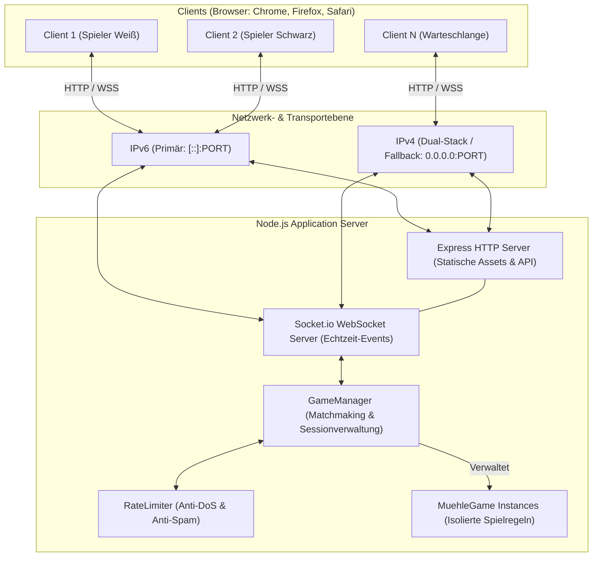
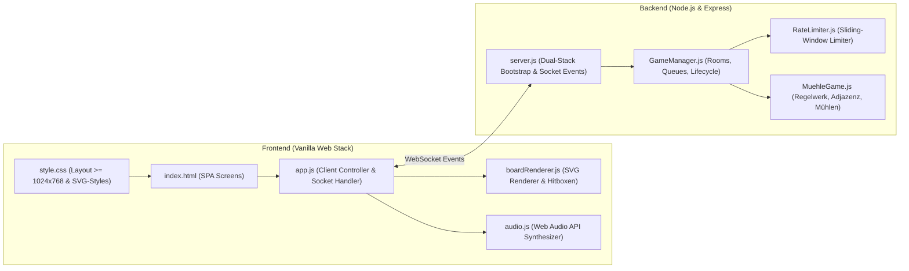
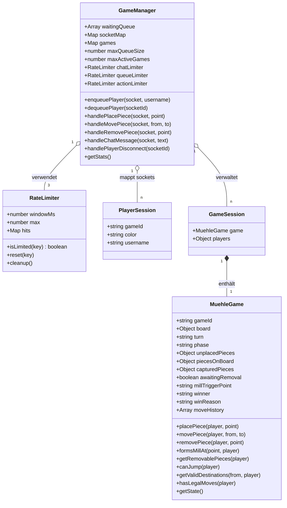
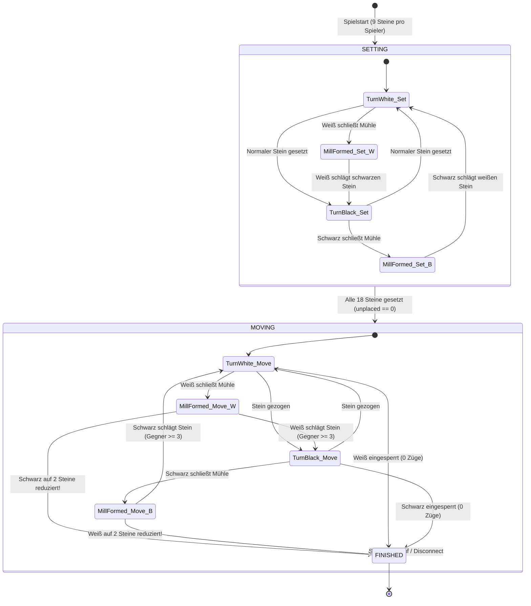
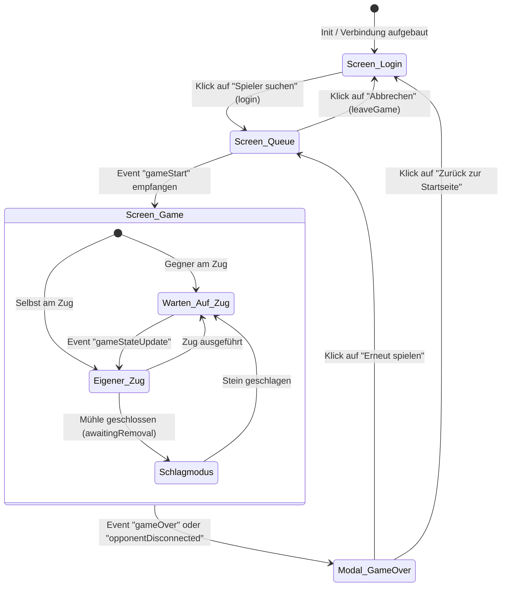
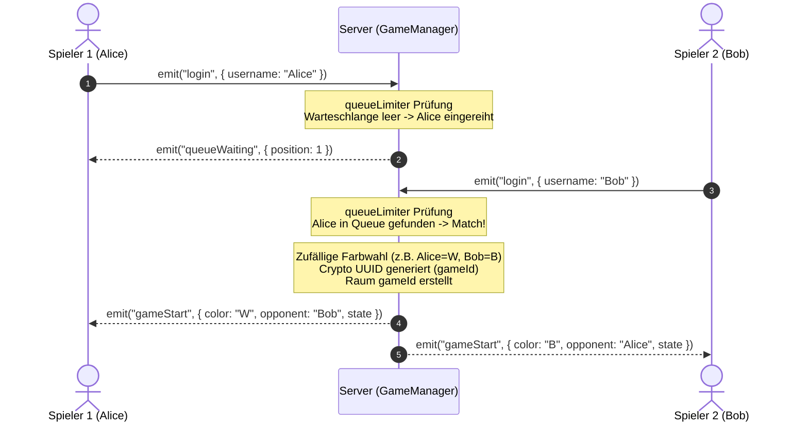
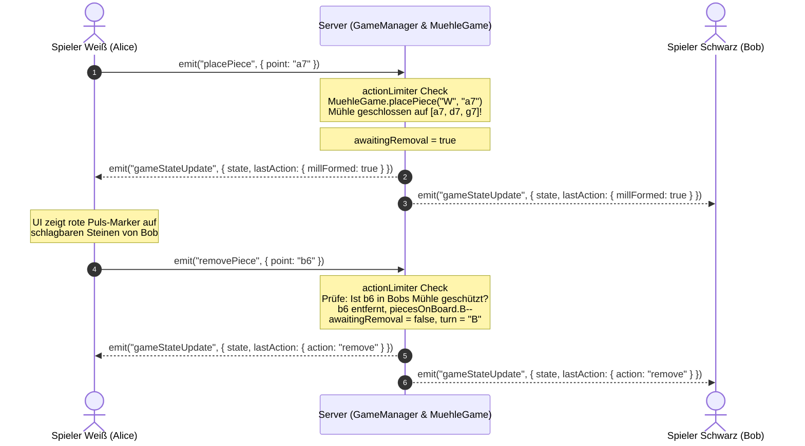
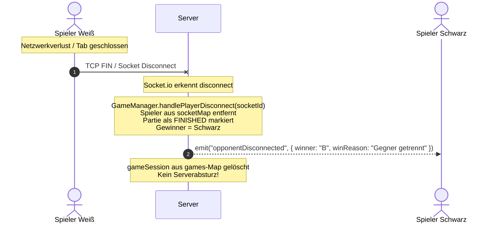
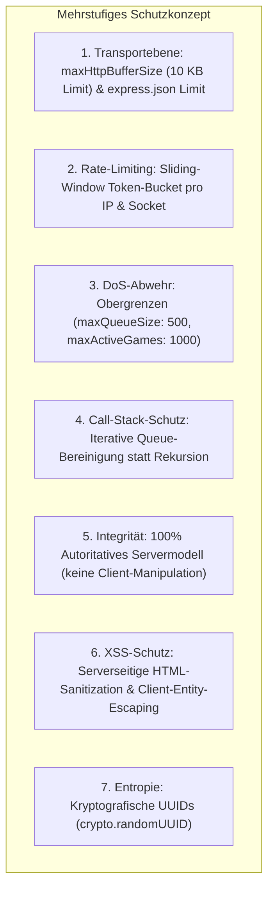

# Systemmodell: Mühle (Nine Men's Morris) Multiplayer-Webanwendung

Dieses Dokument beschreibt die ganzheitliche Systemarchitektur, das Domänenmodell, die Zustandsautomaten, die Interaktionssequenzen sowie das Sicherheits- und Schnittstellendesign der Webanwendung **Mühle**.

---

## Inhaltsverzeichnis
1. [Systemkontext & Architekturübersicht](#1-systemkontext--architekturübersicht)
2. [Komponentenarchitektur](#2-komponentenarchitektur)
3. [Domänen- & Datenmodell](#3-domänen--datenmodell)
4. [Zustandsmodelle (State Machines)](#4-zustandsmodelle-state-machines)
   - 4.1 [Spiellogik-Zustandsautomat](#41-spiellogik-zustandsautomat)
   - 4.2 [Client-Lifecycle-Zustandsautomat](#42-client-lifecycle-zustandsautomat)
5. [Sequenzdiagramme & Interaktionsabläufe](#5-sequenzdiagramme--interaktionsabläufe)
   - 5.1 [Matchmaking & Verbindungsaufbau](#51-matchmaking--verbindungsaufbau)
   - 5.2 [Spielzug, Mühlenschluss & Schlagen](#52-spielzug-mühlenschluss--schlagen)
   - 5.3 [Verbindungsabbruch & Fehlertoleranz](#53-verbindungsabbruch--fehlertoleranz)
6. [Schnittstellenspezifikation (Socket.io-Protokoll)](#6-schnittstellenspezifikation-socketio-protokoll)
7. [Sicherheits- & Resilienzmodell](#7-sicherheits--resilienzmodell)

---

## 1. Systemkontext & Architekturübersicht

Das System ist als **Client-Server-Architektur** konzipiert. Der Server agiert als **autoritative Instanz** (Authoritative Server Model) für alle Spielregeln und die Matchmaking-Verwaltung. Der Client übernimmt die Benutzeroberfläche, Rendering, akustisches Feedback und Benutzerinteraktionen.



---

## 2. Komponentenarchitektur

Das Gesamtsystem gliedert sich in modulare, voneinander entkoppelte Subsysteme auf Client- und Serverseite:



### Komponentenbeschreibung

#### Serverseitige Module
- **`server.js`**: Initialisiert Express, serviert statische Dateien (`/public`), konfiguriert Socket.io mit Payload-Grenzen (`maxHttpBufferSize: 10KB`), bindet das Dual-Stack IPv6/IPv4-Netzwerk und fängt Ausnahmen global ab.
- **`lib/GameManager.js`**: Verwaltet die Matchmaking-Warteschlange, Socket-zu-Spieler-Mappings (`socketMap`), Räume (`games`) und koordiniert Event-Aufrufe.
- **`lib/MuehleGame.js`**: Rein deterministische, autoritative Mühle-Regel-Engine. Verwaltet das Brett (24 Punkte), 32 Adjazenzkanten, 16 Mühlenlinien und validiert Setzen, Ziehen, Springen sowie Sieg-/Verlustbedingungen.
- **`lib/RateLimiter.js`**: In-Memory Sliding-Window Token-Bucket-Filter zum Schutz vor Chat-Floods (CH-05), Queue-Flooding (DOS-01) und Aktions-Spam.

#### Clientseitige Module
- **`public/js/app.js`**: Haupt-Controller für Socket.io-Client, Screen-Wechsel (Login, Queue, Game, Game Over), UI-Aktualisierung und Toast-Nachrichten.
- **`public/js/boardRenderer.js`**: Dynamischer SVG-Renderer. Verankert jeden Knotenpunkt per `transform="translate(x, y)"` und steuert konzentrische Ziel-, Auswahl- und Schlaganimationen.
- **`public/js/audio.js`**: Reiner Web-Audio-API Synthesizer für Soundeffekte (Klicks, Züge, Mühlenklang, Schlag-Impact, Fanfaren).

---

## 3. Domänen- & Datenmodell



### Spielfeld-Geometrie & Adjazenzmodell
Das Brett umfasst **24 Schnittpunkte** in algebraischer Notation über drei konzentrische Quadrate:
- **Äußeres Quadrat:** `a7, d7, g7, g4, g1, d1, a1, a4`
- **Mittleres Quadrat:** `b6, d6, f6, f4, f2, d2, b2, b4`
- **Inneres Quadrat:** `c5, d5, e5, e4, e3, d3, c3, c4`

```
7:  a7 ------------ d7 ------------ g7
    |                |                |
6:  |    b6 -------- d6 -------- f6   |
    |    |           |           |    |
5:  |    |   c5 ---- d5 ---- e5  |    |
    |    |   |               |   |    |
4:  a4 - b4 - c4           e4 - f4 - g4
    |    |   |               |   |    |
3:  |    |   c3 ---- d3 ---- e3  |    |
    |    |           |           |    |
2:  |    b2 -------- d2 -------- f2   |
    |                |                |
1:  a1 ------------ d1 ------------ g1
    a    b   c       d       e   f    g
```

- **32 Kanten:** 24 Kanten auf den Quadraten + 8 Kanten über die Kreuzverbindungen der Mittelpunkte (`d7-d6-d5`, `g4-f4-e4`, `d1-d2-d3`, `a4-b4-c4`).
- **16 Mühlen:** 6 horizontale Linien + 6 vertikale Linien + 4 Querverbindungen.

---

## 4. Zustandsmodelle (State Machines)

### 4.1 Spiellogik-Zustandsautomat (`MuehleGame`)



> **Hinweis zur Phase 3 (Springen):** Ist ein Spieler in der Phase `MOVING` auf genau 3 Steine dezimiert, gilt `canJump(player) == true`. Der Zustandsautomat verbleibt in `MOVING`, die Adjazenzprüfung wird jedoch für diesen Spieler aufgehoben (freies Springen auf beliebige freie Punkte).

---

### 4.2 Client-Lifecycle-Zustandsautomat (`app.js`)



---

## 5. Sequenzdiagramme & Interaktionsabläufe

### 5.1 Matchmaking & Verbindungsaufbau



---

### 5.2 Spielzug, Mühlenschluss & Schlagen



---

### 5.3 Verbindungsabbruch & Fehlertoleranz



---

## 6. Schnittstellenspezifikation (Socket.io-Protokoll)

### Client ➔ Server Events

| Event | Payload | Validierung & Vorbedingungen | Antwort / Reaktion |
|:---|:---|:---|:---|
| `login` | `{ username: string }` | Queue-Rate-Limit aktiv; String getrimmt (max. 20 Zeichen) | `queueWaiting` oder `gameStart` |
| `placePiece` | `{ point: string }` | Phase `SETTING`; `turn == player`; Punkt in `POINTS` & frei | `gameStateUpdate` oder `actionError` |
| `movePiece` | `{ from: string, to: string }` | Phase `MOVING`; `board[from] == player`; Ziel frei; Nachbar oder Jump | `gameStateUpdate` oder `actionError` |
| `removePiece` | `{ point: string }` | `awaitingRemoval == true`; Stein gehört Gegner; Mühlenschutz beachtet | `gameStateUpdate` oder `actionError` |
| `forfeit` | *(kein)* | Spieler in aktivem Spiel | `gameOver` mit Forfeit-Grund |
| `chatMessage` | `{ text: string }` | Chat-Rate-Limit aktiv; Text getrimmt (max. 150 Zeichen) | Broadcast `chatMessage` an Raum |
| `leaveGame` | *(kein)* | Spieler verlässt beendetes Spiel | Bereinigung der Session |
| `disconnect` | *(Transport)* | Automatisch bei Verbindungsverlust | `opponentDisconnected` an verbleibenden Spieler |

### Server ➔ Client Events

| Event | Payload | Beschreibung |
|:---|:---|:---|
| `queueWaiting` | `{ position: number, message: string }` | Bestätigt Warteschlangenplatz |
| `gameStart` | `{ gameId, yourColor, yourName, opponentName, state }` | Startet Spielarena und teilt Farben zu |
| `gameStateUpdate` | `{ state: Object, lastAction: Object }` | Überträgt autoritativen Spielzustand |
| `gameOver` | `{ winner: string, winnerName: string, winReason: string, state }` | Zeigt Spielende-Modal an |
| `opponentDisconnected`| `{ winner, winnerName, winReason, state }` | Informiert über Verbindungsabbruch des Gegners |
| `actionError` | `{ message: string }` | Informiert den Client über Regelverstoß oder Rate-Limit |
| `serverError` | `{ message: string }` | Informiert über Server- oder Warteschlangenüberlastung |
| `chatMessage` | `{ sender: string, color: string, text: string, timestamp: number }` | Übermittelt Chatnachricht an beide Clients |

---

## 7. Sicherheits- & Resilienzmodell



### Implementierte Härtungsmaßnahmen
1. **DoS- und Overflow-Schutz (DOS-01 & DOS-03):**
   - WebSocket-Payloads sind über `maxHttpBufferSize: 1e4` (10 KB) abgeriegelt.
   - `enqueuePlayer()` nutzt eine iterative `while`-Schleife zur Bereinigung veralteter Sockets, wodurch selbst bei 5.000 getrennten Sockets kein `RangeError: Maximum call stack size exceeded` ausgelöst wird.
   - Die Warteschlange ist auf maximal 500 Einträge, aktive Spiele auf maximal 1.000 Instanzen limitiert.
2. **Anti-Spam & Rate-Limiting (CH-05):**
   - Chatnachrichten sind auf maximal 4 Nachrichten pro 2 Sekunden gedrosselt. Bei über 10 wiederholten Verstößen wird der Socket automatisch zwangsgetrennt (`socket.disconnect(true)`).
3. **Zustandsintegrität (MQ-04 & MQ-05):**
   - Das Spielbrett wird ausschließlich über die Server-Engine `MuehleGame` verändert.
   - Züge werden zwingend an die Socket-Identität gekoppelt; fremde Züge oder State-Injektionen sind strukturell unmöglich.
4. **Fehlertoleranz:**
   - Alle Socket-Handler sind in `try/catch`-Blöcken gekapselt.
   - Unhandled Rejections und unvorhergesehene Ausnahmen werden über globale Exception-Handler abgefangen, sodass der Node.js-Prozess niemals abstürzt.
