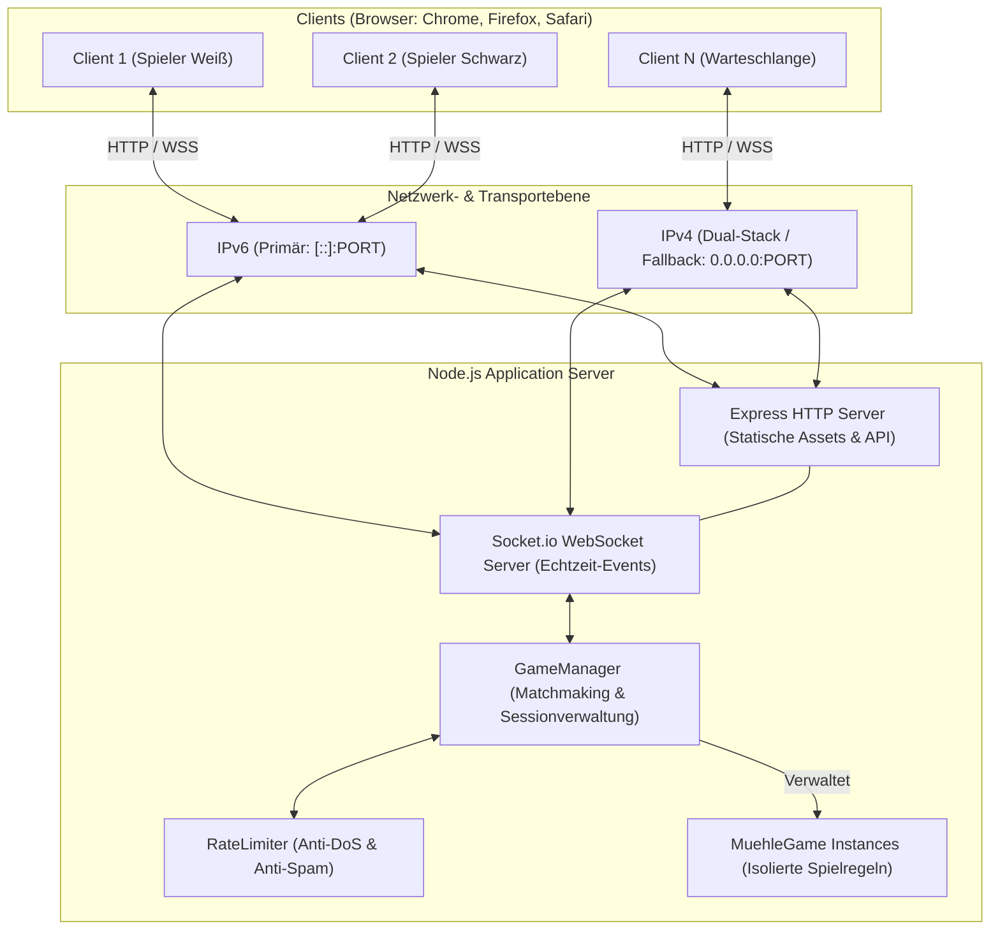
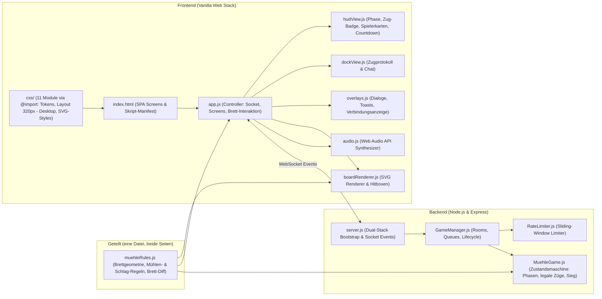
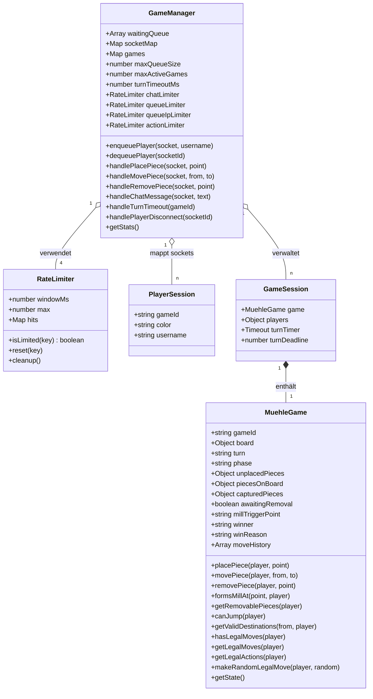
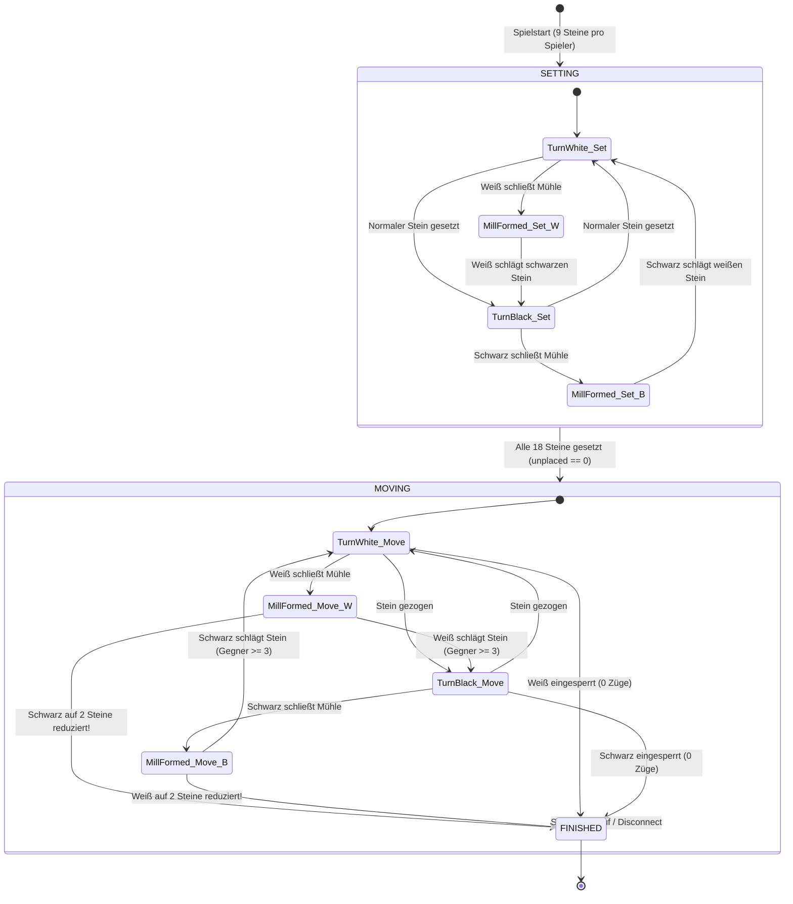
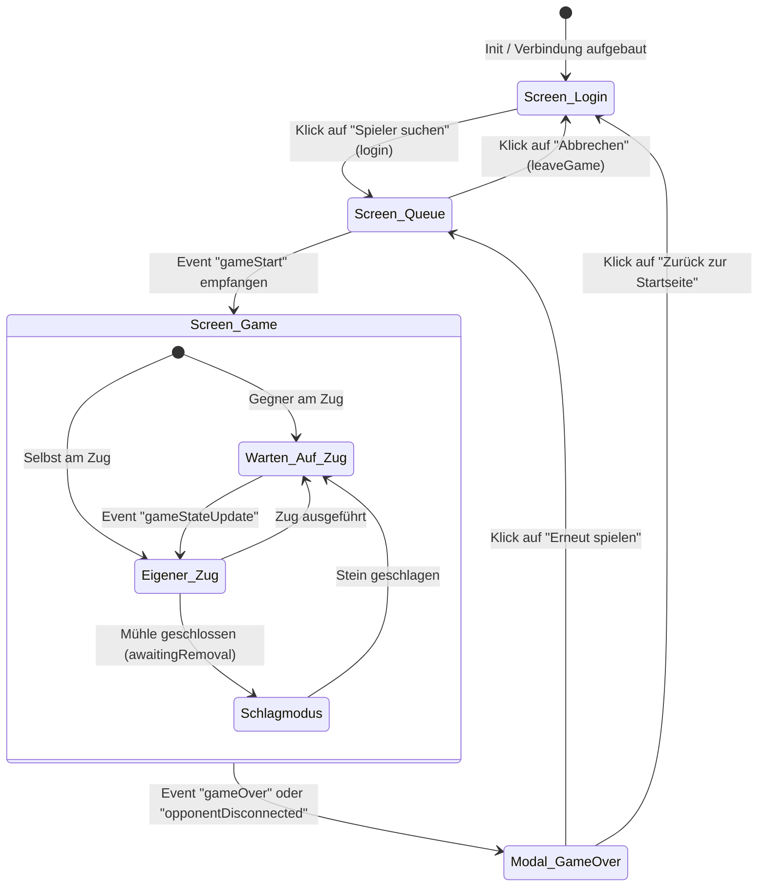
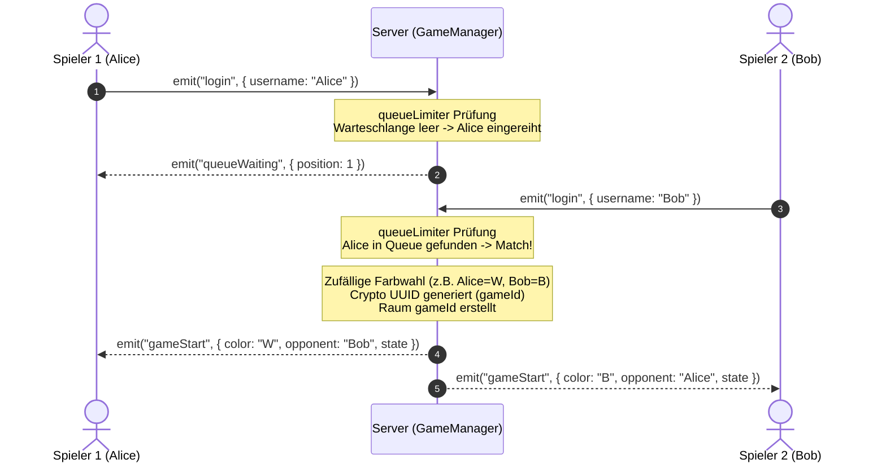
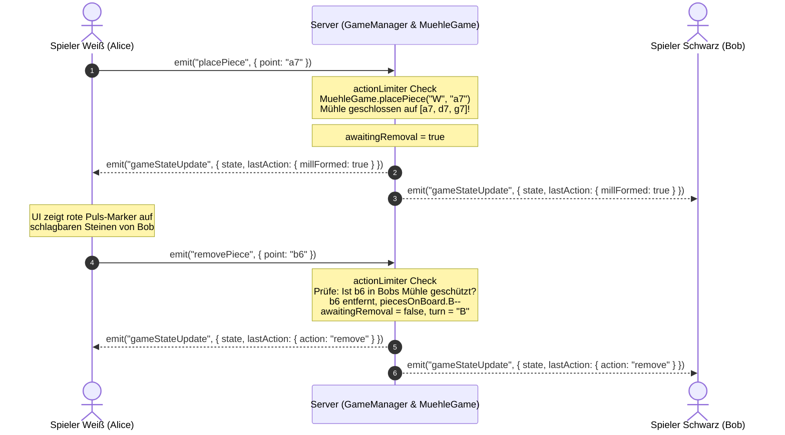
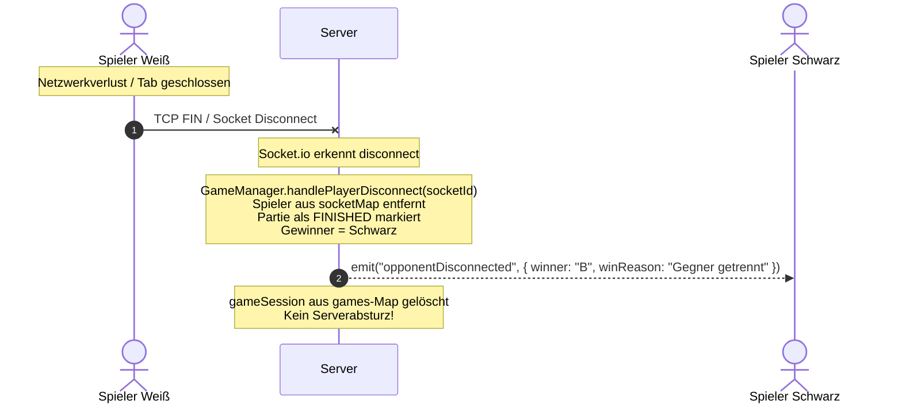
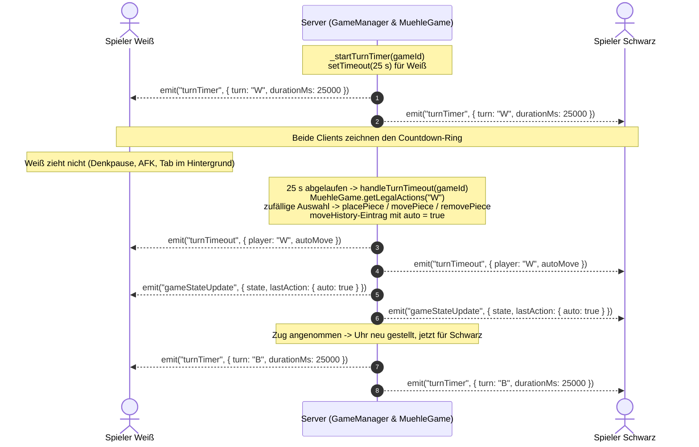
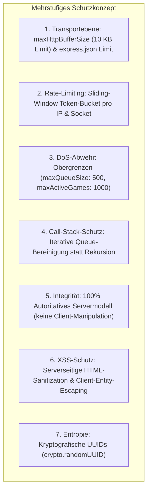

# Systemmodell: Mühle (Nine Men's Morris) Multiplayer-Webanwendung

Dieses Dokument beschreibt die ganzheitliche Systemarchitektur, das Domänenmodell, die Zustandsautomaten, die Interaktionssequenzen sowie das Sicherheits- und Schnittstellendesign der Webanwendung **Mühle**.

---

## Inhaltsverzeichnis
1. [Systemkontext & Architekturübersicht](#1-systemkontext--architekturübersicht)
2. [Komponentenarchitektur](#2-komponentenarchitektur)
3. [Domänen- & Datenmodell](#3-domänen--datenmodell)
4. [Zustandsmodelle (State Machines)](#4-zustandsmodelle-state-machines)
   - 4.1 [Spiellogik-Zustandsautomat](#41-spiellogik-zustandsautomat)
   - 4.2 [Client-Lifecycle-Zustandsautomat](#42-client-lifecycle-zustandsautomat)
5. [Sequenzdiagramme & Interaktionsabläufe](#5-sequenzdiagramme--interaktionsabläufe)
   - 5.1 [Matchmaking & Verbindungsaufbau](#51-matchmaking--verbindungsaufbau)
   - 5.2 [Spielzug, Mühlenschluss & Schlagen](#52-spielzug-mühlenschluss--schlagen)
   - 5.3 [Verbindungsabbruch & Fehlertoleranz](#53-verbindungsabbruch--fehlertoleranz)
   - 5.4 [Zug-Timer & automatischer Zug](#54-zug-timer--automatischer-zug)
6. [Schnittstellenspezifikation (Socket.io-Protokoll)](#6-schnittstellenspezifikation-socketio-protokoll)
7. [Sicherheits- & Resilienzmodell](#7-sicherheits--resilienzmodell)

---

## 1. Systemkontext & Architekturübersicht

Das System ist als **Client-Server-Architektur** konzipiert. Der Server agiert als **autoritative Instanz** (Authoritative Server Model) für alle Spielregeln und die Matchmaking-Verwaltung. Der Client übernimmt die Benutzeroberfläche, Rendering, akustisches Feedback und Benutzerinteraktionen.



---

## 2. Komponentenarchitektur

Das Gesamtsystem gliedert sich in modulare, voneinander entkoppelte Subsysteme auf Client- und Serverseite:



Die Views (`hudView`, `dockView`, `overlays`, `boardRenderer`) besitzen bewusst
keinen Socket: sie bekommen fertige Daten und zeichnen. Nur `app.js` sendet
Aktionen an den Server. `tests/ClientModules.test.js` prüft genau das.

### Komponentenbeschreibung

#### Serverseitige Module
- **`server.js`**: Initialisiert Express, serviert statische Dateien (`/public`), konfiguriert Socket.io mit Payload-Grenzen (`maxHttpBufferSize: 10KB`), bindet das Dual-Stack IPv6/IPv4-Netzwerk und fängt Ausnahmen global ab.
- **`lib/GameManager.js`**: Verwaltet die Matchmaking-Warteschlange, Socket-zu-Spieler-Mappings (`socketMap`), Räume (`games`) und koordiniert Event-Aufrufe. Hier liegt auch der **Zug-Timer**: pro Partie eine eigene Uhr (Standard 25 s), die bei jeder angenommenen Aktion neu startet und bei Ablauf einen automatischen legalen Zug auslöst.
- **`shared/muehleRules.js`**: Das geteilte Regelmodul — Brettgeometrie (24 Punkte, 32 Adjazenzkanten, 16 Mühlenlinien), Mühlen- und Schlag-Regeln sowie der Brett-Diff, alles zustandsfrei. Server-Engine und Browser laden **dieselbe Datei** (der Server per `require`, die Seite über den Mount `/shared`), weshalb es keine zweite Brett-Definition gibt, die auseinanderlaufen könnte.
- **`lib/MuehleGame.js`**: Rein deterministische, autoritative Mühle-Zustandsmaschine auf Basis des geteilten Regelmoduls. Verwaltet Brett, Phase, Zugrecht und Historie und validiert Setzen, Ziehen, Springen sowie Sieg-/Verlustbedingungen. Über `getLegalActions()` / `makeRandomLegalMove()` liefert sie außerdem die vollständige Zugmenge des Spielers am Zug — die Grundlage des automatischen Zugs bei Zeitablauf.
- **`lib/RateLimiter.js`**: In-Memory Sliding-Window Token-Bucket-Filter zum Schutz vor Chat-Floods (CH-05), Queue-Flooding (DOS-01) und Aktions-Spam.
- **`lib/clientAddress.js`**: Ermittelt die Adresse, unter der ein Client limitiert wird. `X-Forwarded-For` wird nur ausgewertet, wenn die Gegenstelle als vertrauenswürdiger Proxy konfiguriert ist (`TRUST_PROXY`); anschließend wird die Adresse auf ihren Block reduziert (IPv4 und IPv4-mapped IPv6 auf die reine IPv4-Adresse, natives IPv6 auf sein `/64`-Präfix), damit ein Client mit eigenem Präfix sein Kontingent nicht durch Adresswechsel umgehen kann.

#### Clientseitige Module
- **`public/js/app.js`**: Controller für Socket.io-Client, Screen-Wechsel (Login, Queue, Game, Game Over) und Brett-Interaktion. Übersetzt Klicks in Server-Anfragen und Server-Events in Aufrufe der Views — er zeichnet selbst nichts.
- **`public/js/hudView.js`**: Phasenanzeige, Zug-Badge, Hinweisbanner, beide Spielerkarten und der Zug-Countdown aus den Server-Events `turnTimer` / `turnTimeout` — reine Anzeige ohne eigene Zeitlogik und ohne Socket.
- **`public/js/dockView.js`**: Zugprotokoll und Chat samt Tab-Leiste und Ungelesen-Markierung auf kleinen Bildschirmen. Hier liegt die Escaping-Grenze: Name und Text einer Nachricht gehen durch `escapeHtml()`, bevor Markup entsteht.
- **`public/js/overlays.js`**: Regel- und Spielende-Dialog, Toasts, Verbindungsanzeige und die Scroll-Sperre hinter einem offenen Dialog.
- **`public/js/boardRenderer.js`**: Dynamischer SVG-Renderer. Verankert jeden Knotenpunkt per `transform="translate(x, y)"` und legt Ziel-, Auswahl- und Schlagmarker einmalig an; ein Zustandswechsel schaltet nur noch deren `is-*`-Klasse um. Das Brett wird einmal aufgebaut und danach nur gepatcht: `MuehleRules.diffBoards()` bestimmt, welche Steine gesetzt, gezogen oder geschlagen wurden; nur diese werden per CSS-Animation eingeblendet, verschoben bzw. ausgeblendet, alle übrigen behalten ihren SVG-Knoten.
- **`public/js/audio.js`**: Reiner Web-Audio-API Synthesizer für Soundeffekte (Klicks, Züge, Mühlenklang, Schlag-Impact, Fanfaren). Jeder Effekt ist als Notenliste beschrieben; ein einziger Scheduler spielt sie.
- **`public/css/`**: Modulares Stylesheet. `style.css` ist reines Manifest und zieht die elf Module per `@import` in Kaskadenreihenfolge herein — `tokens.css` zuerst (Design-Tokens für beide Themes), `responsive.css` zuletzt (Breakpoints, Pointer-Typ, `prefers-reduced-motion`), dazwischen die Module je Screen bzw. Komponente. Werkzeuge, die das Stylesheet als Ganzes lesen (`scripts/contrast-check.js`, die statischen CSS-Tests), gehen über `scripts/css-bundle.js`, das die `@import`-Kette auflöst.

---

## 3. Domänen- & Datenmodell



### Spielfeld-Geometrie & Adjazenzmodell
Das Brett umfasst **24 Schnittpunkte** in algebraischer Notation über drei konzentrische Quadrate:
- **Äußeres Quadrat:** `a7, d7, g7, g4, g1, d1, a1, a4`
- **Mittleres Quadrat:** `b6, d6, f6, f4, f2, d2, b2, b4`
- **Inneres Quadrat:** `c5, d5, e5, e4, e3, d3, c3, c4`

```
7:  a7 ------------ d7 ------------ g7
    |                |                |
6:  |    b6 -------- d6 -------- f6   |
    |    |           |           |    |
5:  |    |   c5 ---- d5 ---- e5  |    |
    |    |   |               |   |    |
4:  a4 - b4 - c4           e4 - f4 - g4
    |    |   |               |   |    |
3:  |    |   c3 ---- d3 ---- e3  |    |
    |    |           |           |    |
2:  |    b2 -------- d2 -------- f2   |
    |                |                |
1:  a1 ------------ d1 ------------ g1
    a    b   c       d       e   f    g
```

- **32 Kanten:** 24 Kanten auf den Quadraten + 8 Kanten über die Kreuzverbindungen der Mittelpunkte (`d7-d6-d5`, `g4-f4-e4`, `d1-d2-d3`, `a4-b4-c4`).
- **16 Mühlen:** 6 horizontale Linien + 6 vertikale Linien + 4 Querverbindungen.

---

## 4. Zustandsmodelle (State Machines)

### 4.1 Spiellogik-Zustandsautomat (`MuehleGame`)



> **Hinweis zur Phase 3 (Springen):** Ist ein Spieler in der Phase `MOVING` auf genau 3 Steine dezimiert, gilt `canJump(player) == true`. Der Zustandsautomat verbleibt in `MOVING`, die Adjazenzprüfung wird jedoch für diesen Spieler aufgehoben (freies Springen auf beliebige freie Punkte).

> **Hinweis zum Zug-Timer:** Der Ablauf der 25-Sekunden-Bedenkzeit fügt dem Automaten **keinen eigenen Zustand** hinzu. Der `GameManager` führt bei Ablauf lediglich einen der ohnehin legalen Züge aus, sodass genau dieselben Übergänge durchlaufen werden wie bei einem menschlichen Zug (siehe [5.4](#54-zug-timer--automatischer-zug)).

---

### 4.2 Client-Lifecycle-Zustandsautomat (`app.js`)



---

## 5. Sequenzdiagramme & Interaktionsabläufe

### 5.1 Matchmaking & Verbindungsaufbau



---

### 5.2 Spielzug, Mühlenschluss & Schlagen



---

### 5.3 Verbindungsabbruch & Fehlertoleranz



---

### 5.4 Zug-Timer & automatischer Zug

Jede einzelne Entscheidung — Setzen, Ziehen und das Schlagen nach einer Mühle — ist auf **25 Sekunden** begrenzt (konfigurierbar über `TURN_TIMEOUT_MS`). Die Uhr gehört zur Partie, nicht zum Client: `GameManager` hält pro `GameSession` genau einen `setTimeout`, der bei jeder angenommenen Aktion über `_broadcastGameState()` neu gestellt wird.



**Designentscheidung — automatischer Zug statt Zugverwirkung:** Bei Ablauf wird ein zufälliger *legaler* Zug ausgeführt (Option C des Issues), nicht der Zug verwirkt. Die Partie bleibt dadurch in Bewegung, der Spielfluss des Gegners wird nicht durch Warten blockiert, und der säumige Spieler verliert nur die freie Wahl, nicht den Zug. Der automatische Zug läuft durch dieselben Methoden wie ein menschlicher (`placePiece`, `movePiece`, `removePiece`) und ist damit zwangsläufig regelkonform; er landet regulär in der `moveHistory`, markiert mit `auto: true`.

**Weitere Eigenschaften:**

| Aspekt | Verhalten |
|---|---|
| Rücksetzung | Jede angenommene Aktion (auch der automatische Zug) startet die Uhr neu. |
| Schlagen nach Mühle | Eigene 25 Sekunden, da es eine eigene Entscheidung ist. Sonst könnte eine Partie im Zustand `awaitingRemoval` unbegrenzt blockieren. |
| Parallele Partien | Jede `GameSession` besitzt ihre eigene Uhr; Timer laufen unabhängig voneinander. |
| Spielende | `_broadcastGameState()` stoppt die Uhr, sobald ein Gewinner feststeht — ein beendetes Spiel bekommt keinen neuen Timer. |
| Verbindungsabbruch | `_endSession()` / `leaveGame()` stoppen die Uhr, bevor die Session aus `games` entfernt wird. Der Callback kann also nie auf eine Partie feuern, die es nicht mehr gibt. |
| Prozess-Lebensdauer | Alle Timer sind `unref()`-ed und halten den Node-Prozess nicht künstlich am Leben. |

**Warum serverseitig:** Ein Countdown im Browser ist manipulierbar (Debugger, angehaltener Tab, verändertes Skript) und damit als Regel wertlos. Der Client erhält deshalb nur die Restzeit und zeichnet sie; die Entscheidung über den Ablauf trifft ausschließlich der Server.

---

## 6. Schnittstellenspezifikation (Socket.io-Protokoll)

### Client ➔ Server Events

| Event | Payload | Validierung & Vorbedingungen | Antwort / Reaktion |
|:---|:---|:---|:---|
| `login` | `{ username: string }` | Queue-Rate-Limit aktiv; String getrimmt (max. 20 Zeichen) | `queueWaiting` oder `gameStart` |
| `placePiece` | `{ point: string }` | Phase `SETTING`; `turn == player`; Punkt in `POINTS` & frei | `gameStateUpdate` oder `actionError` |
| `movePiece` | `{ from: string, to: string }` | Phase `MOVING`; `board[from] == player`; Ziel frei; Nachbar oder Jump | `gameStateUpdate` oder `actionError` |
| `removePiece` | `{ point: string }` | `awaitingRemoval == true`; Stein gehört Gegner; Mühlenschutz beachtet | `gameStateUpdate` oder `actionError` |
| `forfeit` | *(kein)* | Spieler in aktivem Spiel | `gameOver` mit Forfeit-Grund |
| `chatMessage` | `{ text: string }` | Chat-Rate-Limit aktiv; Text getrimmt (max. 150 Zeichen) | Broadcast `chatMessage` an Raum |
| `leaveGame` | *(kein)* | Spieler verlässt beendetes Spiel | Bereinigung der Session |
| `disconnect` | *(Transport)* | Automatisch bei Verbindungsverlust | `opponentDisconnected` an verbleibenden Spieler |

### Server ➔ Client Events

| Event | Payload | Beschreibung |
|:---|:---|:---|
| `queueWaiting` | `{ position: number, message: string }` | Bestätigt Warteschlangenplatz |
| `gameStart` | `{ gameId, yourColor, yourName, opponentName, state }` | Startet Spielarena und teilt Farben zu |
| `gameStateUpdate` | `{ state: Object, lastAction: Object }` | Überträgt autoritativen Spielzustand (`lastAction.auto === true` bei einem Zug, den die Uhr ausgelöst hat) |
| `turnTimer` | `{ turn, awaitingRemoval, durationMs, remainingMs }` | Startet/erneuert den Countdown; wird nach jeder angenommenen Aktion gesendet |
| `turnTimeout` | `{ player, timeoutMs, action, autoMove, message }` | Die Bedenkzeit ist abgelaufen; nennt den Spieler und den automatisch ausgeführten Zug |
| `gameOver` | `{ winner: string, winnerName: string, winReason: string, state }` | Zeigt Spielende-Modal an |
| `opponentDisconnected`| `{ winner, winnerName, winReason, state }` | Informiert über Verbindungsabbruch des Gegners |
| `actionError` | `{ message: string }` | Informiert den Client über Regelverstoß oder Rate-Limit |
| `serverError` | `{ message: string }` | Informiert über Server- oder Warteschlangenüberlastung |
| `chatMessage` | `{ sender: string, color: string, text: string, timestamp: number }` | Übermittelt Chatnachricht an beide Clients |

---

## 7. Sicherheits- & Resilienzmodell



### Implementierte Härtungsmaßnahmen
1. **DoS- und Overflow-Schutz (DOS-01 & DOS-03):**
   - WebSocket-Payloads sind über `maxHttpBufferSize: 1e4` (10 KB) abgeriegelt.
   - `enqueuePlayer()` nutzt eine iterative `while`-Schleife zur Bereinigung veralteter Sockets, wodurch selbst bei 5.000 getrennten Sockets kein `RangeError: Maximum call stack size exceeded` ausgelöst wird.
   - Die Warteschlange ist auf maximal 500 Einträge, aktive Spiele auf maximal 1.000 Instanzen limitiert.
   - Anmeldungen sind auf 5 pro 5 Sekunden je Socket und 20 pro 5 Sekunden je Adresse gedrosselt. Das Adressbudget ist bewusst größer, damit sich Spieler hinter derselben NAT-Adresse (gleiches WLAN, zwei Tabs) nicht gegenseitig ausbremsen.
2. **Anti-Spam & Rate-Limiting (CH-05):**
   - Chatnachrichten sind auf maximal 4 Nachrichten pro 2 Sekunden gedrosselt. Bei über 10 wiederholten Verstößen wird der Socket automatisch zwangsgetrennt (`socket.disconnect(true)`).
3. **Zustandsintegrität (MQ-04 & MQ-05):**
   - Das Spielbrett wird ausschließlich über die Server-Engine `MuehleGame` verändert.
   - Züge werden zwingend an die Socket-Identität gekoppelt; fremde Züge oder State-Injektionen sind strukturell unmöglich.
   - Auch die Bedenkzeit ist Serverzustand: Der Zug-Timer läuft im `GameManager`, der Client zeigt nur die gemeldete Restzeit an. Ein manipulierter oder angehaltener Client verschafft sich damit keine zusätzliche Zeit (siehe [5.4](#54-zug-timer--automatischer-zug)).
4. **Fehlertoleranz:**
   - Alle Socket-Handler sind in `try/catch`-Blöcken gekapselt.
   - Unhandled Rejections und unvorhergesehene Ausnahmen werden über globale Exception-Handler abgefangen, sodass der Node.js-Prozess niemals abstürzt.
